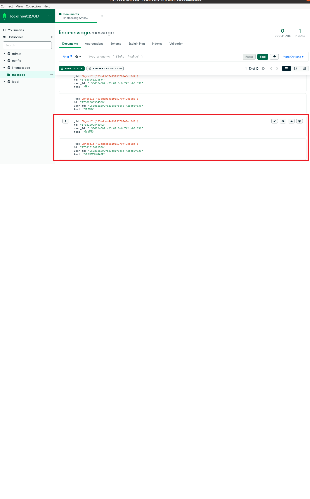
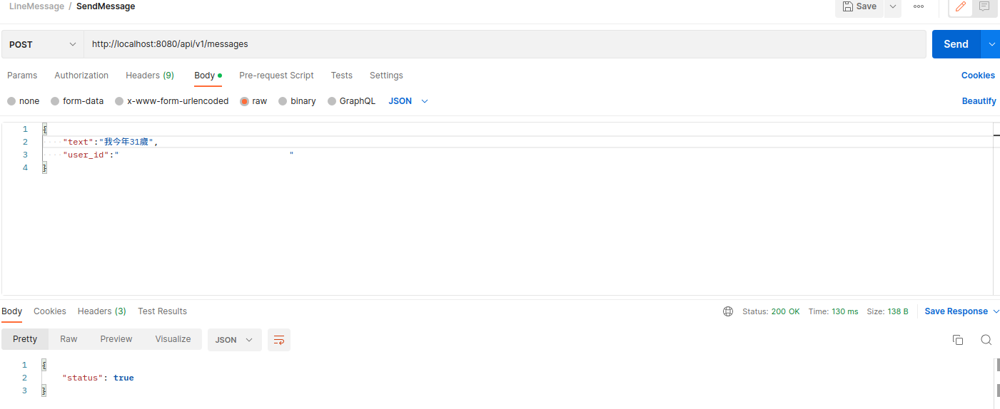
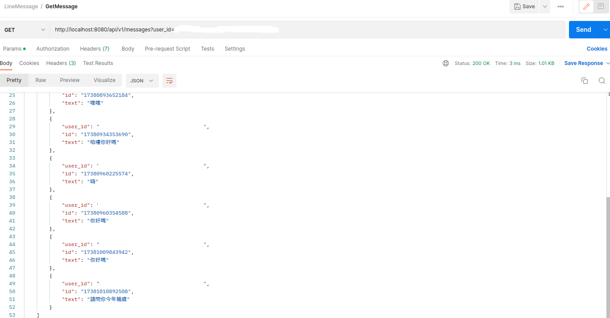

# 使用說明
請先在configs/config.yaml上,填入Line的secret和token後,再執行後面步驟

下載專案進入到根目錄,執行命令啟動mongodb的服務
``` command line
make mongo-build
```
確認mongodb服務運作正常輸入啟動linemessage的服務
``` command line
make app-build
```
確認建立運作正常,前往Line Devlopers設定Webhook URL('your address'/api/v1/webhooks)  
即可開始進行功能測試

# 測試驗證畫面參考
* 功能1. line webhook



* 功能2. create message



* 功能3. query message
